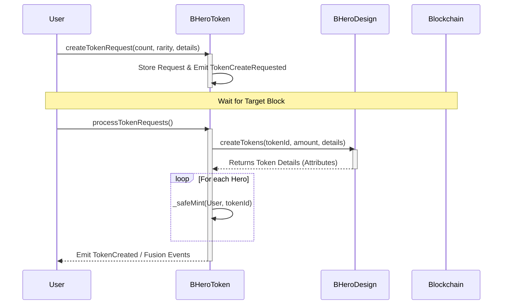
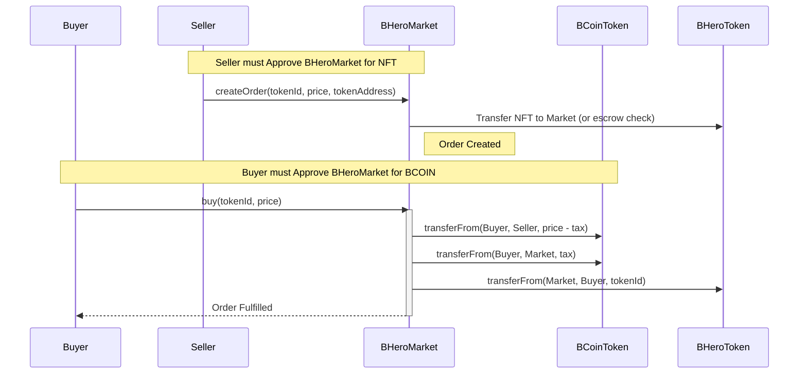
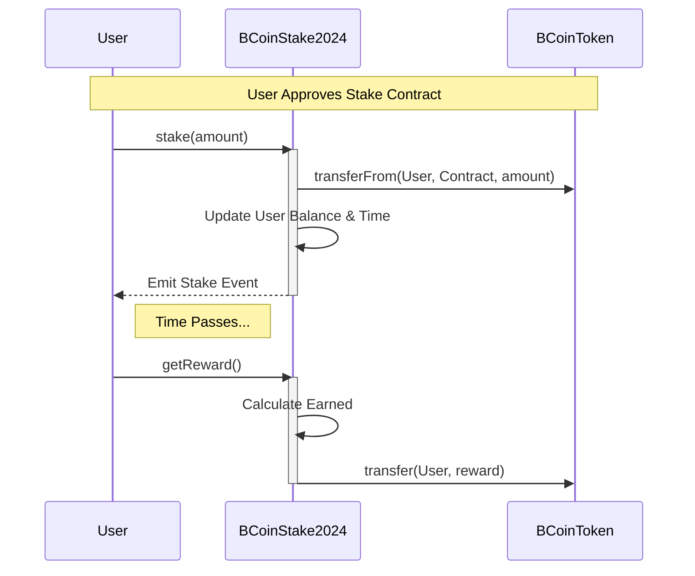

# Architecture: Critical Flows

This document details the sequence of operations for critical business logic within the BombCrypto ecosystem.

## 1. Hero Minting & Randomization

The process of creating a new Hero involves a request-response pattern to ensure randomness (or pseudo-randomness based on block hash).

## 2. Marketplace: Buying a Hero

Buying a Hero on the marketplace requires prior approval of the payment token (BCOIN) and the NFT (by the seller).

## 3. Staking BCOIN

Users stake BCOIN to earn rewards over time.

