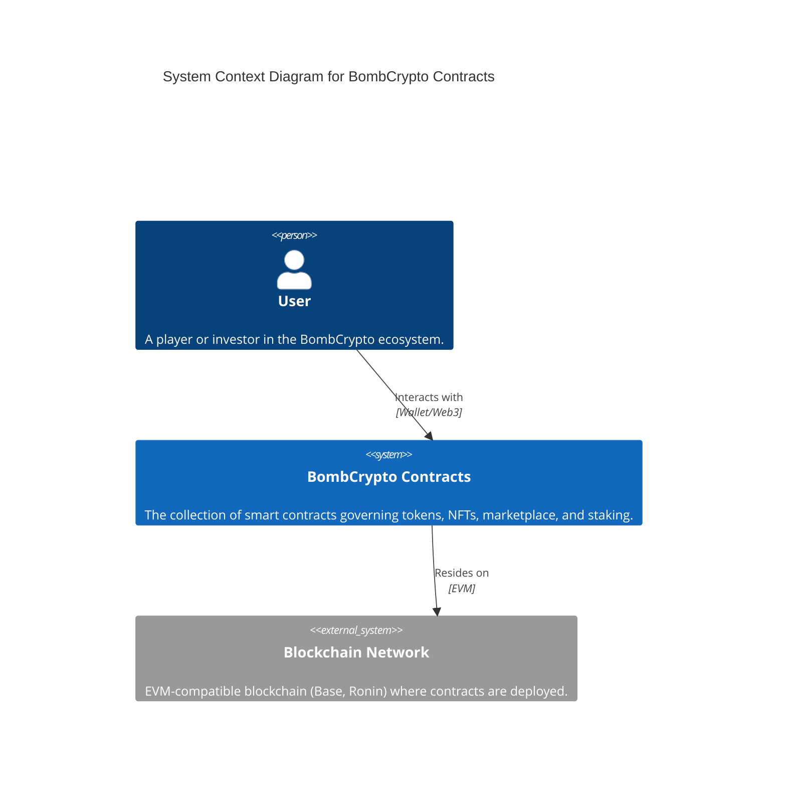
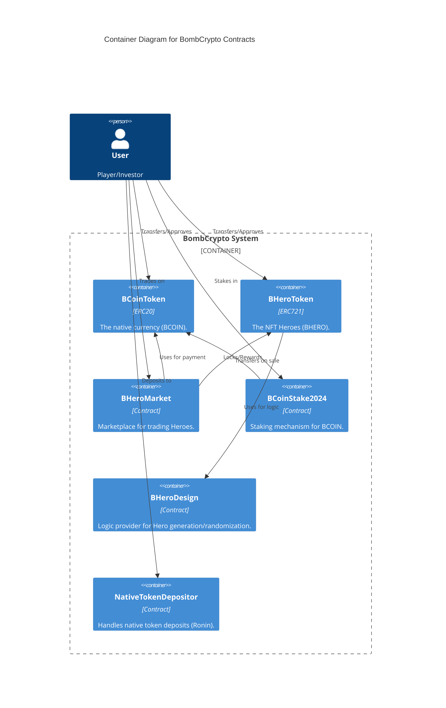

# Architecture: System Context & Containers

## C4 Level 1: System Context

This diagram illustrates the high-level context of the BombCrypto Contract system.

## C4 Level 2: Container Diagram

This diagram zooms into the BombCrypto system to show the key smart contract containers and their relationships.

